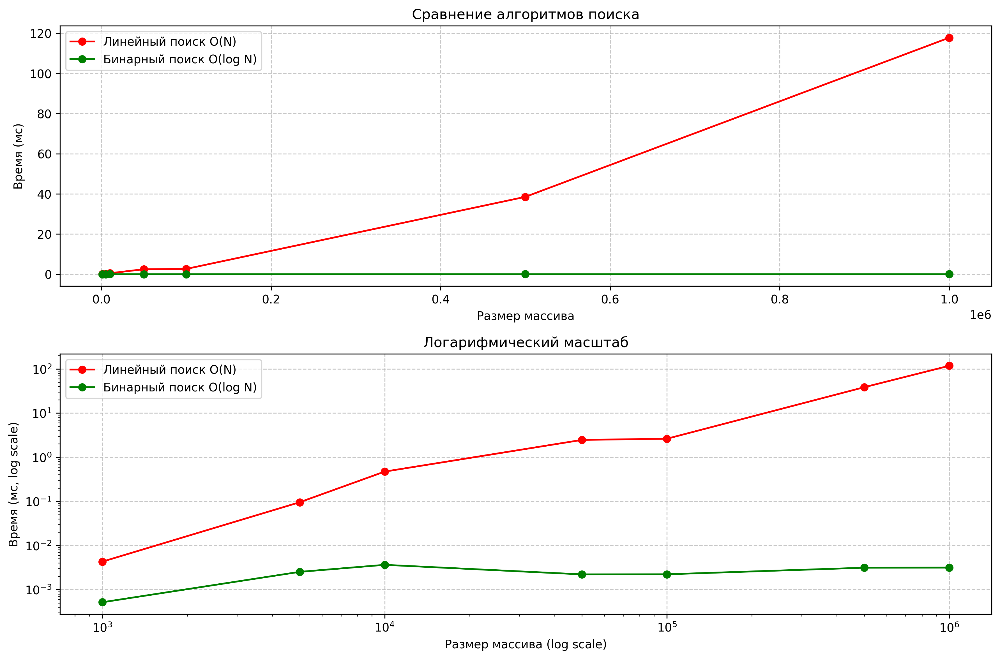

# Лабораторная работа 01: Введение в алгоритмы. Сложность. Поиск

## Цель работы
Освоить понятие вычислительной сложности алгоритмов.  
Получить практические навыки реализации и анализа линейного и бинарного поиска.  
Научиться экспериментально подтверждать теоретические оценки сложности **O(n)** и **O(log n)**.

---

## Теория

- **Сложность алгоритма** - Характеризует количество ресурсов (времени и памяти), необходимых
 алгоритму для обработки входных данных объема n
- **Асимптотический анализ:** - Анализ поведения алгоритма при стремлении n к бесконечности.
 Позволяет абстрагироваться от констант и аппаратных особенностей.
- **O-нотация («О-большое»)** - Верхняя асимптотическая оценка роста функции. Определяет
 наихудший сценарий работы алгоритма.
- **Линейный поиск (Linear Search)** - Последовательный перебор всех элементов массива. Сложность: O(n)
- **Бинарный поиск (Binary Search)** -Поиск в отсортированном массиве путем многократного
 деления интервала поиска пополам. Сложность: O(log n). Требует предварительной сортировки
 (O(n log n)).

### Линейный поиск
- Перебор элементов массива последовательно.  
- В худшем случае проверяет все `n` элементов.  
- Сложность: **O(n)**.  

### Бинарный поиск
- Работает только на отсортированном массиве.  
- На каждом шаге делит интервал поиска пополам.  
- Количество шагов пропорционально `log₂(n)`.  
- Сложность: **O(log n)**.  
- Дополнительно: сортировка массива перед поиском имеет сложность **O(n log n)**.

---

## Практика

### Задание
1. Реализовать функции:
   - `linear_search(arr, target)`  
   - `binary_search(arr, target)`  
2. Добавить комментарии с оценкой сложности каждой строки.  
3. Провести замеры времени выполнения для разных размеров массива.  
4. Построить графики зависимости времени от размера массива.  
5. Сравнить теоретическую и практическую сложность.  

### Подготовка данных
- Сгенерированы отсортированные массивы: `[1000, 5000, 10000, 50000, 100000, 500000]`.  
- Для поиска выбран элемент: **последний** (худший случай).  

### Характеристики ПК
- Процессор: Intel Core i3-10110U @ 2.60GHz
- Оперативная память: 8 GB DDR4
- ОС: Windows 11
- Python: 3.13.2

---

## Результаты замеров

Таблица (время в миллисекундах, усреднение по 10 запускам):

| Размер (n) | Линейный (мс) | Бинарный (мс) |
|------------|----------------|----------------|
| 1 000      | 0.0043         | 0.0005         |
| 5 000      | 0.0953         | 0.0025         |
| 10 000     | 0.4713         | 0.0036         |
| 50 000     | 2.4630         | 0.0022         |
| 100 000    | 2.6196         | 0.0022         |
| 500 000    | 38.5132        | 0.0031         |
| 1 000 000  | 117.7746       | 0.0032         |

## Графики

### 1. В линейном масштабе и логарифмическом масштабах

---

## Анализ результатов

1. Теоретически:
   - Линейный поиск: **O(n)**.  
   - Бинарный поиск: **O(log n)**.  
2. Эксперименты подтвердили:
   - Время линейного поиска растёт **пропорционально n**.  
   - Время бинарного поиска растёт очень медленно  
3. Разница особенно заметна на больших массивах: бинарный поиск работает в сотни раз быстрее.  

---

## Выводы
- Реализованы линейный и бинарный поиск.  
- Погрешности в замерах обусловлены многозадачностью ОС, кэшированием, работой интерпретатора Python и случайными колебаниями времени на микросекундных интервалах. Для больших массивов они не влияют на общий тренд: линейный поиск растёт пропорционально N, бинарный почти не изменяется.
- Полученные замеры подтверждают теоретическую асимптотику.  
- Бинарный поиск значительно эффективнее при больших входных данных.  
- Работа показала важность выбора алгоритма: асимптотическая разница даёт колоссальный выигрыш на практике.  