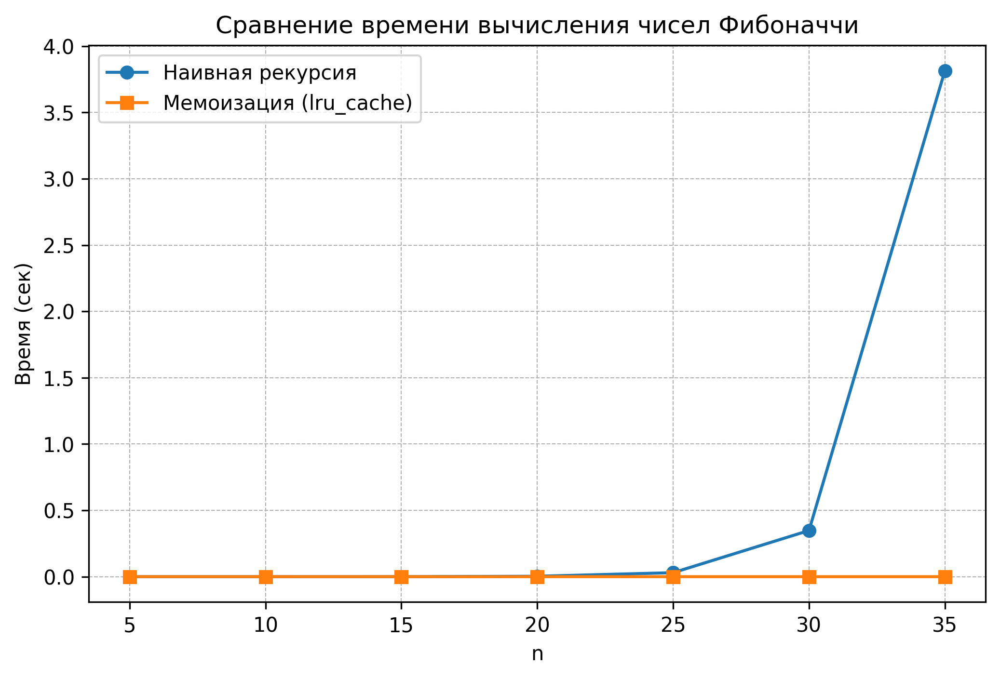

# Отчет по лабораторной работе 03
# Рекурсия

**Дата:** 2025-10-07 

**Семестр:** 3 курс 2 полугодие - 6 семестр

**Группа:** ПИЖ-б-о-23-1

**Дисциплина:** Анализ сложности алгоритмов

**Студент:** Пронченко Савелий Олегович

## Цель работы
Освоить принцип рекурсии, научиться анализировать рекурсивные алгоритмы и
 понимать механизм работы стека вызовов. Изучить типичные задачи, решаемые рекурсивно, и освоить
 технику мемоизации для оптимизации рекурсивных алгоритмов. Получить практические навыки
 реализации и отладки рекурсивных функций

---

## Теоритическая часть

## Теоретическая часть
- **Числа Фибоначчи** — последовательность \(F_n\), где \(F_0 = 0, F_1 = 1\), а каждое последующее число определяется как \(F_n = F_{n-1} + F_{n-2}\).  
- **Наивный рекурсивный алгоритм** реализует последовательность буквально через рекурсивные вызовы. Проблема: одно и то же значение вычисляется много раз.  
- **Мемоизация** — метод хранения ранее вычисленных результатов для повторного использования, что уменьшает количество вычислений и ускоряет алгоритм.  

## Практическая часть

### Задание

1. Реализовать классические рекурсивные алгоритмы.
2. Проанализировать их временную сложность и глубину рекурсии.
3. Реализовать оптимизацию рекурсивных алгоритмов с помощью мемоизации.
4. Сравнить производительность наивной рекурсии и рекурсии с мемоизацией.
5. Решить практические задачи с применением рекурсии

### Характеристики ПК
- Процессор: Intel Core i5-10110U @ 2.60GHz
- Оперативная память: 8 GB DDR4
- ОС: Windows 11
- Python: 3.13.2

## Результаты замеров

Таблица (время в миллисекундах, усреднение по 10 запускам):

|  n  |  naive (s)  |  naive_calls  |  memo (s)  |  memo_calls  |
|:---:|:------------:|:-------------:|:-----------:|:-------------:|
|  5  | 0.000006 | 15 | 0.000002 | 6 |
| 10  | 0.000022 | 177 | 0.000002 | 11 |
| 15  | 0.000264 | 1973 | 0.000003 | 16 |
| 20  | 0.003414 | 21891 | 0.000006 | 21 |
| 25  | 0.033551 | 242785 | 0.000007 | 26 |
| 30  | 0.387496 | 2692537 | 0.000009 | 31 |

## Графики

### 1. В линейном масштабе

---

## Анализ результатов

Наивный алгоритм демонстрирует экспоненциальный рост времени выполнения, так как одно и то же число Фибоначчи вычисляется многократно. Для больших значений `n` такой подход становится крайне неэффективным.

Использование мемоизации решает эту проблему: каждое число вычисляется лишь один раз, а повторные обращения к уже найденным значениям занимают `O(1)`. В результате временная сложность снижается до `O(n)`, что подтверждается экспериментально: алгоритм с мемоизацией работает почти мгновенно даже при `n = 35`, тогда как наивный вариант требует нескольких секунд.

---

## Контрольные вопросы

1. Что такое базовый случай и рекурсивный шаг в рекурсивной функции? Почему отсутствие базового случая приводит к ошибке?

Базовый случай — условие, при котором рекурсия прекращается и возвращается результат напрямую (например, F(0)=0, F(1)=1).
Рекурсивный шаг — часть функции, которая вызывает саму себя с новыми параметрами (например, F(n) = F(n-1) + F(n-2)).
Без базового случая рекурсия не остановится, что приведет к переполнению стека вызовов (RecursionError).

2. Объясните, как работает механизм мемоизации. Как он меняет временную сложность вычисления чисел Фибоначчи по сравнению с наивной рекурсией?

Мемоизация сохраняет результаты ранее вычисленных вызовов в словарь или массив.
При повторном вызове функция сразу возвращает сохранённое значение, без повторных вычислений.
Временная сложность падает с O(2^n) до O(n), так как каждое число вычисляется только один раз.

3. В чем заключается основная проблема глубокой рекурсии и как она связана со стеком вызовов?

Каждый рекурсивный вызов сохраняется в стеке вызовов.
Если рекурсия слишком глубокая, стек переполняется → программа завершится с ошибкой.
Это ограничивает максимальную глубину рекурсии и требует аккуратного проектирования рекурсивных алгоритмов.

4. Задача о Ханойских башнях решается рекурсивно. Опишите алгоритм решения для 3 дисков.

Обозначим башни A, B, C. Цель: перенести все диски с A на C.
Перенести 2 верхних диска с A на B рекурсивно.
Перенести 3-й (самый большой) диск с A на C.
Перенести 2 верхних диска с B на C рекурсивно.

5. Рекурсивный и итеративный алгоритмы могут решать одни и те же задачи. Назовите преимущества и недостатки каждого подхода.

|Подход | Преимущества | Недостатки |
|-------|--------------|------------|
|Рекурсивный | Легко читается, естественно описывает задачи с повторяющейся структурой | Риск переполнения стека, может быть медленным без оптимизации (мемоизация) |
|Итеративный | Эффективнее по памяти, нет переполнения стека | Меньше наглядности, иногда сложнее написать для сложных задач |