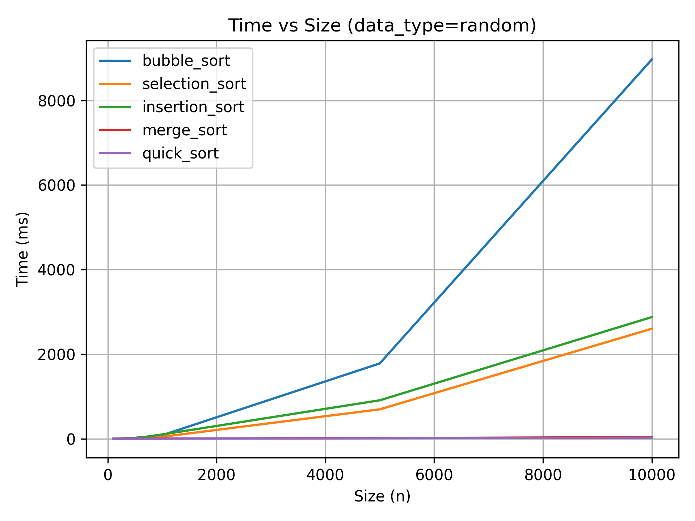
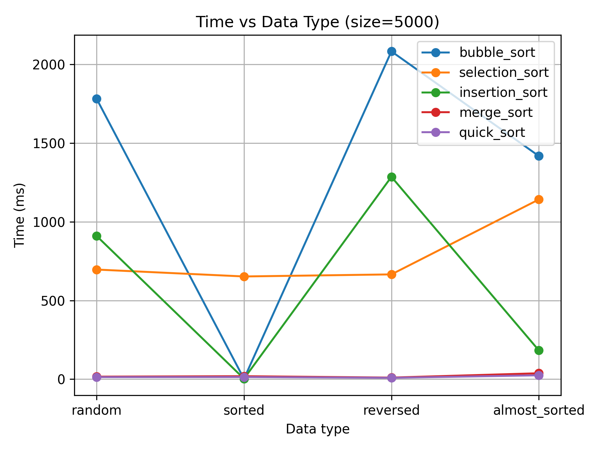

# Отчет по лабораторной работе 04
# Алгоритмы сортировки

**Дата:** 2025-10-07 

**Семестр:** 3 курс 2 полугодие - 6 семестр

**Группа:** ПИЖ-б-о-23-1

**Дисциплина:** Анализ сложности алгоритмов

**Студент:** Пронченко Савелий Олегович

## Цель работы
Изучить и реализовать основные алгоритмы сортировки. Провести их теоретический и
практический сравнительный анализ по временной и пространственной сложности. Исследовать
влияние начальной упорядоченности данных на эффективность алгоритмов. Получить навыки
эмпирического анализа производительности алгоритмов

---

## Теоритическая часть
В данной лабораторной работе изучаются пять основных алгоритмов сортировки: пузырьковая сортировка, сортировка выбором, сортировка вставками, сортировка слиянием и быстрая сортировка. Ниже приведено их краткое описание, принципы работы и вычислительная сложность.

---

### 1. Сортировка пузырьком (Bubble Sort)

**Описание:**  
Алгоритм многократно проходит по массиву, сравнивая соседние элементы и меняя их местами, если они стоят в неправильном порядке. На каждом проходе самый крупный элемент «всплывает» в конец массива.

**Сложность:**
- Время: **O(n²)** — во всех случаях  
- Память: **O(1)** — сортировка на месте  
- Устойчивость: **да**

---

### 2. Сортировка выбором (Selection Sort)

**Описание:**  
На каждом шаге алгоритм ищет минимальный элемент в неотсортированной части массива и ставит его на следующую позицию отсортированной части.

**Сложность:**
- Время: **O(n²)** — во всех случаях  
- Память: **O(1)**  
- Устойчивость: **нет**

---

### 3. Сортировка вставками (Insertion Sort)

**Описание:**  
Алгоритм формирует отсортированную последовательность, вставляя элементы один за другим в правильную позицию, сдвигая соседние элементы вправо.

**Сложность:**
- Лучший случай: **O(n)** — массив уже отсортирован  
- Средний: **O(n²)**  
- Худший: **O(n²)**  
- Память: **O(1)**  
- Устойчивость: **да**

---

### 4. Сортировка слиянием (Merge Sort)

**Описание:**  
Рекурсивный алгоритм типа «разделяй и властвуй»: массив делится на две половины, сортируется рекурсивно, а затем отсортированные части сливаются.

**Сложность:**
- Время: **O(n log n)** — во всех случаях  
- Память: **O(n)** — требуется дополнительный буфер  
- Устойчивость: **да**

---

### 5. Быстрая сортировка (Quick Sort)

**Описание:**  
Алгоритм выбирает опорный элемент и делит массив на элементы, которые меньше, равны и больше него. Далее части сортируются рекурсивно.

**Сложность:**
- Средний случай: **O(n log n)**  
- Худший случай: **O(n²)** — при неудачном выборе опорного элемента  
- Память: **O(log n)** — глубина рекурсии  
- Устойчивость: **нет**

---

## Практическая часть

### Задание

- Реализовать 5 алгоритмов сортировки.
- Провести теоретический анализ сложности каждого алгоритма.
- Экспериментально сравнить время выполнения алгоритмов на различных наборах данных.
- Проанализировать влияние начальной упорядоченности данных на эффективность сортировок.

## Характеристики ПК
- Процессор: Intel Core i5-10110U @ 2.60GHz
- Оперативная память: 8 GB DDR4
- ОС: Windows 11
- Python: 3.13.2

---

## Графики

### 1. time_vs_size

---

### 2. time_vs_type

`deque.popleft()` остаётся практически константой (O(1)),  
а `list.pop(0)` растёт линейно (O(n)).

---

## Выводы по результатам экспериментов и графикам

На основании проведённых измерений времени работы алгоритмов сортировки были построены два графика:

- **Зависимость времени работы от размера массива (random data)**  
- **Зависимость времени работы от начального состояния массива (size = 5000)**  

Анализ графиков позволяет сделать следующие выводы.

---

### 1. Сравнение алгоритмов по времени работы при увеличении размера массива

На графике *Time vs Size (data_type=random)* наблюдается следующая картина:

1. **Пузырьковая сортировка (Bubble Sort)**  
   - Работает значительно медленнее остальных алгоритмов.  
   - Время растёт квадратично (практически идеальная парабола).  
   - При n = 10 000 время превышает 9000 мс.  
   - Подтверждает теоретическую сложность **O(n²)**.

2. **Сортировка выбором (Selection Sort) и сортировка вставками (Insertion Sort)**  
   - Также демонстрируют квадратичный рост времени.  
   - Insertion Sort работает быстрее Selection Sort на случайных данных, но всё равно существенно проигрывает алгоритмам O(n log n).  
   - При n = 10 000 время достигает ~2500–3000 мс.

3. **Сортировка слиянием (Merge Sort)**  
   - Время работы почти незаметно на фоне квадратичных алгоритмов, всегда остаётся очень низким.  
   - Демонстрирует стабильную сложность **O(n log n)**.

4. **Быстрая сортировка (Quick Sort)**  
   - Самый быстрый алгоритм среди всех тестируемых.  
   - Время практически близко к нулю на всех размерах, благодаря эффективной реализации и низким накладным расходам.

*Вывод:*  
Алгоритмы **Bubble**, **Selection** и **Insertion** непрактичны для работы с большими массивами из-за квадратичной сложности.  
Алгоритмы **Merge Sort** и особенно **Quick Sort** — наиболее эффективны для больших объёмов данных.

---

### 2. Влияние типа входных данных на время сортировки (size = 5000)

На графике *Time vs Data Type (size = 5000)* видим:

1. **Bubble Sort**
   - Работает быстрее всего на «sorted» данных (лучший случай).  
   - На «reversed» данные — худший случай, что приводит к резкому росту времени.  
   - Большая чувствительность к структуре данных.

2. **Selection Sort**
   - Время почти не меняется от типа данных — совпадает с теорией.  
   - Алгоритм всегда делает одинаковое количество сравнений.

3. **Insertion Sort**
   - Очень быстрый на «sorted» данных (почти O(n)).  
   - Худший случай — «reversed» данные: время резко увеличивается.  
   - При «almost_sorted» также работает значительно быстрее случайных данных.

4. **Merge Sort**
   - Почти не зависит от входных данных.  
   - Время стабильно и низкое.

5. **Quick Sort**
   - Почти тот же уровень на всех типах данных.  
   - Случайный выбор pivot обеспечивает отсутствие деградации.

*Вывод:*  
Алгоритмы **Insertion Sort** и **Bubble Sort** очень чувствительны к упорядоченности данных.  
**Selection Sort**, **Merge Sort** и **Quick Sort** демонстрируют стабильную производительность, причём Quick Sort остаётся самым быстрым.

---

### Итоговый вывод

1. **Квадратичные алгоритмы (Bubble, Selection, Insertion)** демонстрируют слабую производительность на больших данных: время растёт как O(n²).  
2. **Insertion Sort** показывает хорошие результаты на частично упорядоченных данных.  
3. **Merge Sort** стабилен и предсказуем, но требует дополнительную память.  
4. **Quick Sort** — наиболее эффективный алгоритм сортировки среди протестированных, обеспечивая минимальное время на всех наборах данных.  
5. Тип входных данных существенно влияет только на алгоритмы с квадратичной сложностью.

## Контрольные вопросы

### 1. Какие алгоритмы сортировки имеют сложность O(n²) в худшем случае, а какие — O(n log n)? Почему так?

#### Алгоритмы со сложностью **O(n²)**:
- **Bubble Sort (пузырьковая сортировка):**  
  Каждый элемент многократно сравнивается с соседними. Полный проход по массиву повторяется n раз, что даёт сумму операций `n + (n−1) + … + 1 = O(n²)`.

- **Selection Sort (сортировка выбором):**  
  Находит минимум в оставшейся части массива, выполняя полный поиск даже на почти отсортированных данных — из-за этого сложность стабильно O(n²).

- **Insertion Sort (сортировка вставками):**  
  В худшем случае (массив отсортирован в обратном порядке) каждый новый элемент нужно "проталкивать" через всю отсортированную часть, что тоже даёт O(n²).

#### Алгоритмы со сложностью **O(n log n)**:
- **Merge Sort (сортировка слиянием):**  
  Рекурсивно делит массив пополам, создавая логарифмическую глубину рекурсии (`log₂(n)`), а на каждом уровне производит линейное слияние (`n`).  
  Итог: `O(n log n)` при любом типе данных.

- **Quick Sort (быстрая сортировка):**  
  В среднем разделяет массив примерно пополам, что приводит к сложности `O(n log n)`.  
  Однако при неудачном выборе pivot (например, первый элемент в уже отсортированном массиве) деление становится крайне неравномерным → худший случай **O(n²)**.

#### Почему O(n log n) лучше на больших массивах?
- Квадратичные алгоритмы растут слишком быстро: при удвоении массива время увеличивается в четыре раза.  
- Алгоритмы "разделяй и властвуй" (Merge, Quick) уменьшают задачу на каждом шаге, поэтому рост времени гораздо медленнее — логарифмический компонент играет ключевую роль при больших n.

---

### 2. Почему сортировка вставками (Insertion Sort) эффективна для маленьких или почти отсортированных массивов?

- **Для маленьких массивов:**  
  Сложные рекурсивные алгоритмы (Quick/Merge) имеют накладные расходы: вызовы функций, выделение памяти, копирование массивов.  
  Insertion Sort работает на простых циклах, и при n < ~50 часто оказывается быстрее.

- **Для почти отсортированных массивов:**  
  Каждый элемент оказывается почти на своём месте, поэтому требуется минимальное количество сдвигов.  
  В лучшем случае алгоритм проходит массив один раз и работает за **O(n)**.

- **Адаптивность:**  
  В отличие от Bubble и Selection, Insertion Sort "пользуется" частичной упорядоченностью данных — чем массив ближе к отсортированному, тем быстрее работает.

---

### 3. Разница между устойчивой (stable) и неустойчивой (unstable) сортировкой

#### Устойчивая сортировка:
- Сохраняет порядок элементов с одинаковым значением ключа.  
- Пример: два человека с возрастом 20 лет сохранят порядок по имени после сортировки по возрасту.

**Примеры устойчивых алгоритмов:**  
Bubble Sort, Insertion Sort, Merge Sort.

#### Неустойчивая сортировка:
- Элементы с одинаковыми ключами могут поменяться местами.

**Примеры неустойчивых алгоритмов:**  
Quick Sort (в классической реализации), Selection Sort.

#### Почему это важно:
- Устойчивость необходима при многоуровневой сортировке (например, по дате, а затем по имени).  
- Неустойчивые алгоритмы могут работать быстрее или проще, но не сохраняют внутренний порядок равных элементов.

---

### 4. Принцип работы Quick Sort. Опорный элемент и влияние его выбора

**Принцип работы ("разделяй и властвуй"):**
1. Выбирается опорный элемент (pivot).
2. Массив делится на две части:
   - элементы меньше pivot  
   - элементы больше pivot
3. Части сортируются рекурсивно.

**Почему важен выбор pivot:**
- **Удачный pivot** (приблизительно медианное значение):  
  Обе части массива примерно равны → глубина рекурсии ≈ log₂(n) → сложность **O(n log n)**.

- **Неудачный pivot** (например, первый элемент в отсортированном массиве):  
  Один подмассив почти пустой, другой содержит ~n−1 элементов → рекурсия превращается в цепочку длины n → сложность **O(n²)**.

**Вывод:**  
Quick Sort очень быстрый на случайных данных, но чувствителен к структуре массива при плохом выборе pivot.

---

### 5. Когда Merge Sort предпочтительнее Quick Sort?

**Преимущества Merge Sort:**
- Гарантированная сложность **O(n log n)** для любых данных.  
- Алгоритм устойчивый (сохраняет порядок одинаковых элементов).  
- Отлично подходит для **внешней сортировки** (когда данные хранятся на диске, а не в памяти).

**Когда выбирать Merge Sort:**
- Если важно полностью предсказуемое время работы.  
- Если требуется стабильность сортировки.  
- При работе с очень большими данными, где сортировка выполняется блоками.

**Минусы Merge Sort:**
- Требует дополнительную память — **O(n)**.  
- Quick Sort можно реализовать почти без дополнительной памяти (in-place).

**Итог:**  
Merge Sort выбирают, когда нужна стабильность, предсказуемость и безопасность от худшего случая. Quick Sort — когда важна максимальная скорость и ограничена память.