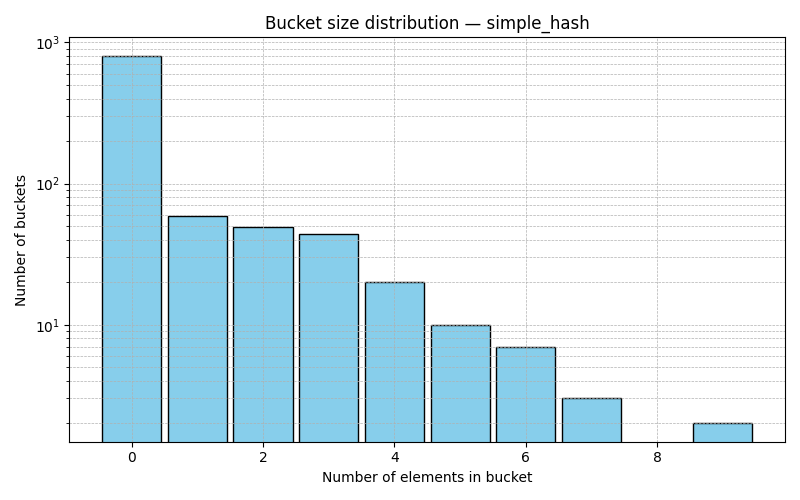
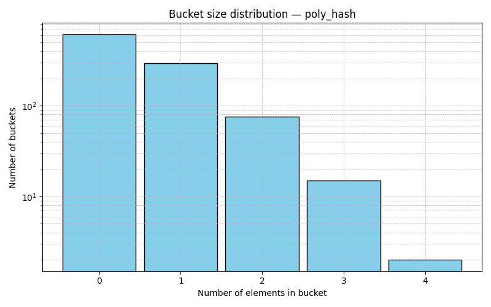
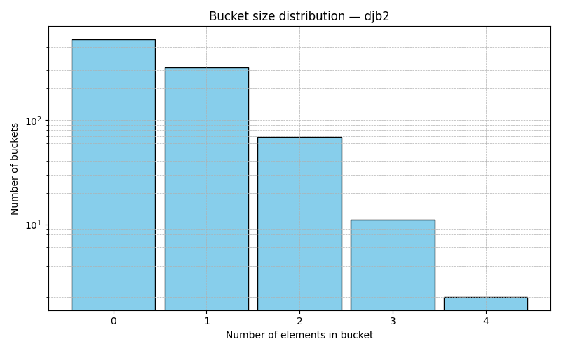
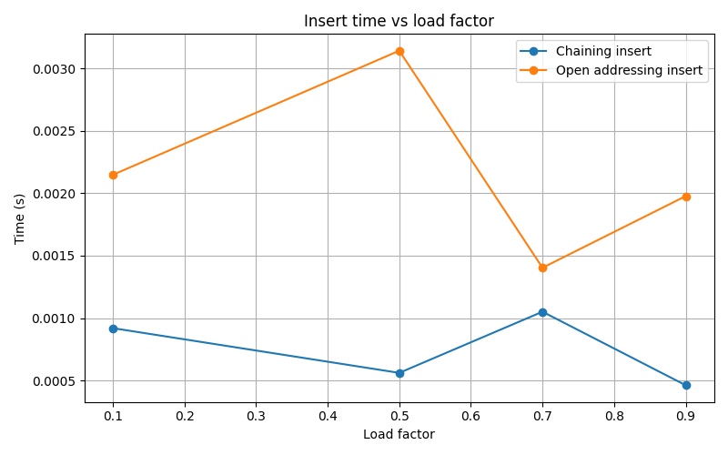

# Лабораторная работа №05  
# Хеш-таблицы и методы разрешения коллизий

**Дата:** 2025-10-21  
**Семестр:** 3 курс, 2 полугодие — 6 семестр  
**Группа:** ПИЖ-б-о-23-1  
**Дисциплина:** Анализ сложности алгоритмов  
**Студент:** Пронченко Савелий Олегович  

---

## Цель работы

Изучить и реализовать хеш-таблицы с разными методами разрешения коллизий и хеш-функциями. Проанализировать:

- равномерность распределения хеш-функций;
- производительность операций вставки/поиска/удаления;
- влияние коэффициента заполнения (load factor);
- различия между методами цепочек и открытой адресации.

---

## Теоретическая часть

### 1. HashTableChaining (метод цепочек)

**Принцип работы:**
- Таблица состоит из массива списков (бакетов).
- Все элементы с одинаковым хешем попадают в один бакет.

**Сложность:**

| Операция | Средняя | Худшая |
|----------|----------|--------|
| Вставка | O(1) | O(n) |
| Поиск | O(1) | O(n) |
| Удаление | O(1) | O(n) |

**Особенности:**
- Слабо чувствителен к загрузке.
- Нет кластеризации.
- Устойчивость к коллизиям высокая.

---

### 2. HashTableOpenAddressing (открытая адресация)

Режимы:
- линейное пробирование,
- двойное хеширование.

**Принцип работы:**
- Все элементы хранятся в одном массиве.
- Коллизии разрешаются поиском следующего свободного слота.

**Сложность:**

| Операция | Средняя | При высоком LF |
|----------|----------|----------------|
| Вставка | O(1) | O(n) |
| Поиск | O(1) | O(n) |
| Удаление | O(1) | O(n) |

**Особенности:**
- Очень высокая кэш-локальность.
- Чувствительность к load factor.
- Кластеризация при линейном пробировании.

---

### 3. Хеш-функции

Используются три функции:

- **simple_hash** — сумма кодов символов (плохое распределение),
- **poly_hash** — полиномиальный rolling hash (нормальное распределение),
- **djb2** — наиболее равномерная функция.

---

## Характеристики ПК

- CPU: Intel Core i5-10110U @ 2.60 GHz  
- RAM: 8 GB DDR4  
- OS: Windows 11
- Python: 3.13.2  

---

## Графики

### 1. Гистограммы распределения размеров бакетов  
*(качество хеш-функций)*

### 2. Время вставки при разном коэффициенте заполнения  
*(chaining vs open addressing)*

---

## Экспериментальный анализ

### 1. Эффективность методов разрешения коллизий

**chaining:**
- деградация плавная,
- хорошо работает даже при LF ≈ 0.9,
- длины цепочек растут медленно.

**Open addressing (linear):**
- высокая скорость при LF ≤ 0.5,
- резкое ухудшение после LF > 0.7,
- выраженная кластеризация.

**Вывод:**  
Метод цепочек намного устойчивее при высокой загрузке.  
Открытая адресация быстрее на малом LF, но резко деградирует.

---

### 2. Оптимальный коэффициент заполнения

| Метод | Оптимальный LF | Поведение при превышении |
|------|----------------|---------------------------|
| Chaining | 0.7–0.8 | умеренная деградация |
| Open addressing | ≤ 0.5 | резкое падение скорости |
| Linear probing | ≤ 0.6 | сильная кластеризация |

---

### 3. Влияние хеш-функции

По графику распределения:

- **simple_hash** → много коллизий, плохое распределение.  
- **poly_hash** → равномернее, меньше больших бакетов.  
- **djb2** → самое равномерное распределение.

**Вывод:**  
djb2 обеспечивает лучшую производительность таблицы.

---

## Итоговые выводы

1. Метод цепочек более устойчив к высокому load factor.
2. Открытая адресация быстрее при низком LF, но чувствительна к заполнению.
3. Оптимальные значения LF:
   - chaining — до 0.8,
   - open addressing — до 0.5.
4. Хеш-функции существенно влияют на качество распределения.
5. djb2 — оптимальная функция среди протестированных.

---

## Контрольные вопросы

### 1. В чём различия методов разрешения коллизий?

- **Chaining** использует списки — нет кластеризации, лучше при высоком LF.
- **Open addressing** ищет свободный слот внутри массива — быстро при малом LF.

### 2. Почему высокое значение LF вредно для открытой адресации?

Пробирование создаёт кластеры, из-за чего время поиска растёт до O(n).

### 3. Почему хеш-функция критична для open addressing?

Она определяет равномерность первом размещения. Плохая функция приводит к последовательным кластерам.

### 4. Зачем нужен tombstone?

Чтобы не обрывать цепочку пробирования при удалении.

### 5. Почему chaining безопаснее при коллизиях?

Потому что каждая коллизия — просто добавление в список, а не повторное пробирование.

---
