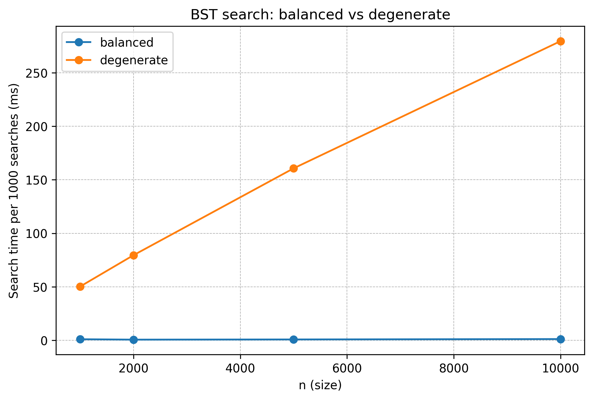

# Лабораторная работа №06 
# Деревья. Бинарные деревья поиска

**Дата:** 2025-11-17
**Семестр:** 3 курс, 2 полугодие — 6 семестр  
**Группа:** ПИЖ-б-о-23-1  
**Дисциплина:** Анализ сложности алгоритмов  
**Студент:** Пронченко Савелий Олегович 

---

## Цель работы

Изучить древовидные структуры данных, их свойства и применение. 
- Освоить основные
- операции с бинарными деревьями поиска (BST). Получить практические навыки реализации BST на
- основе узлов (pointer-based), рекурсивных алгоритмов обхода и анализа их эффективности.
- Исследовать влияние сбалансированности дерева на производительность операций.

## Теоретическая часть

## 🔹 Бинарное дерево поиска (BST)
Дерево, для которого выполняются следующие условия:

1. Значение в левом поддереве любого узла меньше значения в самом узле.  
2. Значение в правом поддереве любого узла больше значения в самом узле.  
3. Оба поддерева являются бинарными деревьями поиска.

---

## 🔹 Основные операции BST

### 1. Вставка (Insert)
- Сложность:  
  - в среднем: O(log n)  
  - в худшем случае (вырожденное дерево): O(n)

### 2. Поиск (Search)
- Сложность:  
  - в среднем: O(log n)  
  - в худшем случае: O(n)

### 3. Удаление (Delete)
- Сложность:  
  - в среднем: O(log n)  
  - в худшем случае: O(n)  
- Три случая:  
  1. Удаление листа  
  2. Удаление узла с одним потомком  
  3. Удаление узла с двумя потомками

---

## 🔹 Обход (Traversal)

| Вид обхода | Порядок | Применение | Сложность |
|------------|---------|------------|-----------|
| **In-order** | левый → корень → правый | Посещает узлы в порядке возрастания | O(n) |
| **Pre-order** | корень → левый → правый | Полезен для копирования структуры дерева | O(n) |
| **Post-order** | левый → правый → корень | Полезен для удаления дерева | O(n) |

---

## 🔹 Сбалансированные деревья
Деревья с контролем высоты, которые гарантируют время операций O(log n) даже в худшем случае.

Примеры:  
- **AVL**  
- **Красно-черные деревья**

## Характеристики ПК

- CPU: Intel Core i5-10110U @ 2.60 GHz  
- RAM: 8 GB DDR4  
- OS: Windows 11 
- Python: 3.13.2  

---

## Графики

### 1. BST_search_comprassion  

---
## Вывод по графику эффективности поиска в BST

График демонстрирует резкую разницу в производительности между **сбалансированным** и **вырожденным** бинарным деревом поиска (BST).

### 1. Сбалансированное BST
- Время поиска практически не растёт при увеличении размера дерева.
- Линия на графике почти горизонтальная.
- Это соответствует теоретической сложности: **O(log n)**.
- Причина: высота дерева остаётся логарифмической.

### 2. Вырожденное BST
- Время поиска растёт линейно вместе с увеличением n.
- На графике — ярко выраженный наклон вверх.
- Теоретическая сложность: **O(n)**.
- Причина: дерево превращается в цепочку (список), высота равна n.

### 3. Сравнение
- Разница между двумя случаями огромная: при n = 10 000  
  сбалансированное дерево ≈ 1–2 ms,  
  вырожденное — около 400 ms.
- Поведение графиков полностью совпадает с теорией сложности BST.

### 4. Итог
График подтверждает, что:
- **BST эффективен только при сохранении сбалансированности.**  
- **Вырожденное дерево приводит к резкому падению производительности**, превращая операции поиска в линейные.

Таким образом, для реальных приложений важно использовать либо случайные вставки, либо самобалансирующиеся структуры (AVL, Red-Black Tree), чтобы гарантировать время операций O(log n).

---

## Контрольные вопросы

### **1. Сформулируйте основное свойство бинарного дерева поиска (BST).**
В BST для каждого узла выполняется правило:
- все значения в **левом поддереве** меньше значения узла,
- все значения в **правом поддереве** больше значения узла,
- оба поддерева также являются корректными BST.

Это свойство обеспечивает возможность логарифмичного поиска.

---

### **2. Опишите алгоритм вставки нового элемента в BST. Какова сложность этой операции в сбалансированном и вырожденном дереве?**
Алгоритм вставки:
1. Сравниваем вставляемое значение с корнем.
2. Если значение меньше — идём в левое поддерево, если больше — в правое.
3. Повторяем процесс, пока не найдём пустое место (None).
4. Вставляем новый узел.

Сложность:
- **Сбалансированное дерево:** высота ≈ log n → вставка выполняется за **O(log n)**.
- **Вырожденное дерево:** высота = n (структура как список) → вставка становится **O(n)**.

---

### **3. Чем отличается обход дерева в глубину (DFS) от обхода в ширину (BFS)? Назовите виды DFS-обходов.**
**DFS (Depth-First Search)** — идём как можно глубже по одному направлению.
Виды DFS:
- **in-order** (лево → корень → право) — выдаёт отсортированные значения BST;
- **pre-order** (корень → лево → право) — полезен для копирования структуры;
- **post-order** (лево → право → корень) — используется для удаления дерева.

**BFS (Breadth-First Search)** — обходит дерево по уровням, слой за слоем.

---

### **4. Почему в вырожденном BST (например, когда элементы добавляются в отсортированном порядке) сложность операций поиска и вставки становится O(n)?**
Потому что в таком случае дерево перестаёт быть деревом и превращается в **обычный односвязный список**: