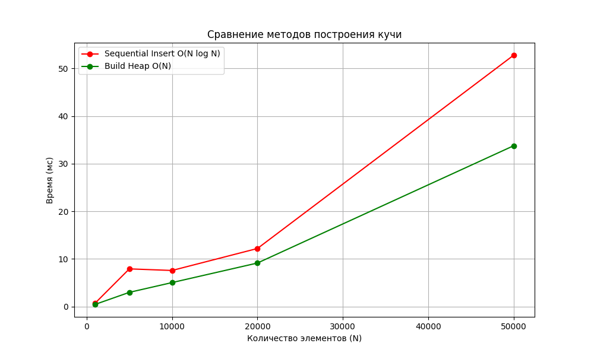
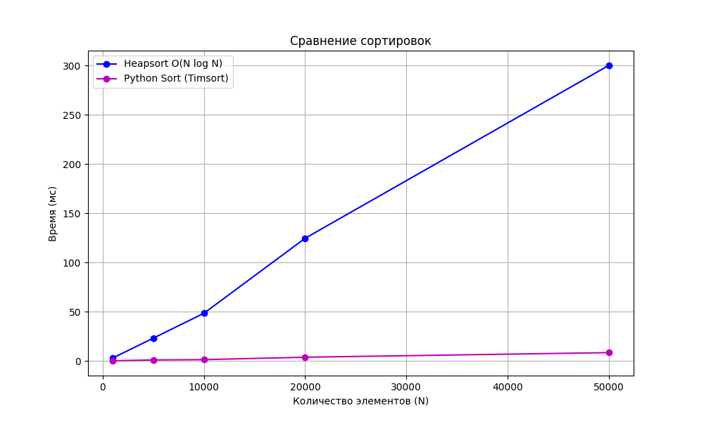

# Лабораторная работа №07
# Кучи (Heaps)

**Дата:** 2025-11-24
**Семестр:** 3 курс, 2 полугодие — 6 семестр
**Группа:** ПИЖ-б-о-23-1
**Дисциплина:** Анализ сложности алгоритмов
**Студент:** Пронченко Савелий Олегович

---

## Цель работы

Изучить структуру данных "куча" (heap), её свойства и применение.
- Освоить основные операции с кучей (добавление, извлечение корня, построение).
- Получить практические навыки реализации кучи на основе массива (array-based).
- Исследовать эффективность основных операций и применить кучу для реализации пирамидальной сортировки (Heapsort) и приоритетной очереди.

## Теоретическая часть

## 🔹 Куча (Heap)
Специализированная древовидная структура данных, удовлетворяющая свойству кучи. Является **полным бинарным деревом**. Обычно реализуется на базе динамического массива.

Для узла с индексом `i` в массиве:
- **Родитель:** `(i - 1) // 2`
- **Левый потомок:** `2 * i + 1`
- **Правый потомок:** `2 * i + 2`

---

## 🔹 Свойство кучи

### 1. Min-Heap (Мин-куча)
Значение в любом узле **меньше или равно** значениям его потомков. Минимальный элемент всегда находится в корне.

### 2. Max-Heap (Макс-куча)
Значение в любом узле **больше или равно** значениям его потомков. Максимальный элемент всегда находится в корне.

---

## 🔹 Основные операции и сложность

| Операция | Описание | Сложность |
|----------|----------|-----------|
| **Вставка (Insert)** | Добавление элемента в конец + `sift_up` | O(log n) |
| **Извлечение (Extract)** | Удаление корня, перемещение последнего элемента в корень + `sift_down` | O(log n) |
| **Построение (Build Heap)** | Преобразование массива в кучу (просеивание с середины) | O(n) |
| **Heapsort** | Сортировка массива с использованием кучи | O(n log n) |

---

## Характеристики ПК

- CPU: Intel Core i3-10110U @ 2.60 GHz
- RAM: 8 GB DDR4
- OS: Windows 11
- Python: 3.13.2

---

## Графики

### 1. Сравнение методов построения кучи (Build Heap vs Insert)

### 2. Сравнение сортировок (Heapsort vs Python Sort)

---

## Вывод по графикам эффективности

### 1. Построение кучи (Build Heap)
- График наглядно демонстрирует преимущество алгоритма `build_heap`.
- **Sequential Insert (Красная линия):** Время растет нелинейно, соответствуя сложности **O(n log n)**.
- **Build Heap (Зеленая линия):** Линия практически прямая ниже, что подтверждает линейную сложность **O(n)**.
- **Вывод:** Для создания кучи из готового массива метод `build_heap` значительно эффективнее поэлементной вставки.

### 2. Сортировка (Heapsort)
- Сравнивалась реализованная сортировка кучей (Heapsort) и встроенная сортировка Python (Timsort).
- Обе сортировки показывают схожий характер роста времени (**O(n log n)**).
- **Heapsort** работает медленнее встроенной функции, так как реализован на чистом Python, тогда как Timsort написан на C и имеет ряд оптимизаций для реальных данных.
- Однако Heapsort демонстрирует стабильную производительность и не требует дополнительной памяти (**O(1)** memory), так как сортировка происходит in-place.

---

## Контрольные вопросы

### **1. Сформулируйте основное свойство min-кучи и max-кучи.**
- **Min-Heap:** Значение в любом узле меньше или равно значениям его детей. Самый маленький элемент — в корне.
- **Max-Heap:** Значение в любом узле больше или равно значениям его детей. Самый большой элемент — в корне.

---

### **2. Опишите алгоритм операции вставки нового элемента в кучу (процедуру sift_up).**
1. Новый элемент добавляется в самый конец массива (чтобы сохранить структуру полного дерева).
2. Элемент сравнивается со своим родителем.
3. Если порядок нарушен (например, в Min-Heap сын меньше отца), они меняются местами.
4. Процесс повторяется, пока элемент не дойдет до корня или пока порядок не станет верным.

---

### **3. Какова временная сложность построения кучи из произвольного массива и почему она равна O(n), а не O(n log n)?**
Сложность **O(n)**.
Это достигается за счет использования алгоритма `build_heap` (просеивание вниз), который начинается с последних родителей.
- Большинство узлов (листья) находятся на нижнем уровне, для них высота = 0 (операций не требуется).
- Чем выше узел, тем больше работы, но таких узлов экспоненциально меньше.
- Сумма ряда операций сходится к линейной зависимости от n.

---

### **4. Опишите, как работает алгоритм пирамидальной сортировки (Heapsort).**
1. Строится **Max-Heap** из исходного массива.
2. Корень (максимум) меняется местами с последним элементом массива.
3. Размер кучи уменьшается на 1 (последний элемент считается отсортированным).
4. Выполняется просеивание вниз (`sift_down`) для нового корня, чтобы восстановить свойство кучи.
5. Шаги 2-4 повторяются, пока куча не опустеет.

---

### **5. Почему кучу часто используют для реализации приоритетной очереди? Какие операции приоритетной очереди она эффективно поддерживает?**
Куча позволяет выполнять обе ключевые операции за логарифмическое время **O(log n)**:
1. Добавление задачи с приоритетом (`enqueue`).
2. Извлечение задачи с наивысшим приоритетом (`dequeue`).

В обычном массиве одна из этих операций занимала бы O(n), что слишком медленно для больших очередей. Куча — идеальный баланс.