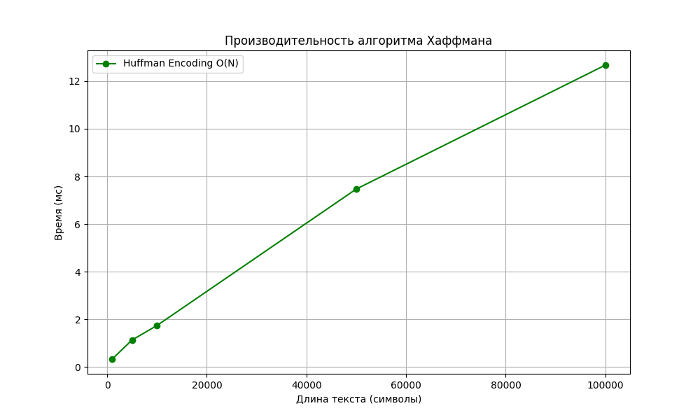

# Лабораторная работа №08
# Жадные алгоритмы

**Дата:** 2025-11-24
**Семестр:** 3 курс, 2 полугодие — 6 семестр
**Группа:** ПИЖ-б-о-23-1
**Дисциплина:** Анализ сложности алгоритмов
**Студент:** Пронченко Савелий Олегович

---

## Цель работы

Изучить парадигму жадных алгоритмов, освоить принцип локально оптимального выбора.
- Реализовать классические задачи: выбор заявок, непрерывный рюкзак, код Хаффмана.
- Проанализировать корректность жадного выбора.
- Сравнить эффективность жадного подхода с полным перебором на примере дискретного рюкзака.

## Теоретическая часть

## 🔹 Жадный алгоритм
Алгоритм, который на каждом шаге принимает локально оптимальное решение, надеясь, что итоговое решение будет глобально оптимальным.

**Ключевые свойства:**
1. **Жадный выбор:** Можно сделать оптимальный выбор сейчас, не оглядываясь назад.
2. **Оптимальная подструктура:** Оптимальное решение задачи содержит оптимальные решения её подзадач.

## 🔹 Реализованные алгоритмы

### 1. Выбор заявок (Interval Scheduling)
- **Задача:** Выбрать макс. число непересекающихся интервалов.
- **Стратегия:** Сортировка по **времени окончания**.
- **Сложность:** O(N log N) (из-за сортировки).
- **Корректность:** Выбирая заявку, которая заканчивается раньше всех, мы оставляем максимально возможное количество времени для остальных заявок.

### 2. Непрерывный рюкзак (Fractional Knapsack)
- **Задача:** Максимизировать стоимость, разрешено брать доли предметов.
- **Стратегия:** Сортировка по убыванию **удельной стоимости (цена / вес)**.
- **Сложность:** O(N log N).
- **Корректность:** Мы всегда берем "самую ценную плоть" из доступных.

### 3. Код Хаффмана (Huffman Coding)
- **Задача:** Построить оптимальный префиксный код для сжатия текста.
- **Стратегия:** Объединение двух символов с **наименьшей частотой**.
- **Сложность:** O(N log N) или O(N) при условии сортировки частот. В реализации O(K log K) для кучи, где K - алфавит.

---

## Характеристики ПК
- CPU: Intel Core i3-10110U @ 2.60 GHz
- RAM: 8 GB DDR4
- OS: Windows 11
- Python: 3.13.2

---

## Результаты анализа

### Сравнение для задачи о Рюкзаке 0-1 (Дискретный)
Было проведено сравнение жадного подхода и полного перебора для задачи, где предметы нельзя делить.

**Входные данные:**
- Вместимость: 50
- Предмет 1: Вес 10, Цена 60 (Ratio 6)
- Предмет 2: Вес 20, Цена 100 (Ratio 5)
- Предмет 3: Вес 30, Цена 120 (Ratio 4)

**Результаты:**
1. **Жадный алгоритм:** Взял Предмет 1 и Предмет 2. Вес 30, Цена **160**. (Предмет 3 не влез).
2. **Оптимальный (Полный перебор):** Взял Предмет 2 и Предмет 3. Вес 50, Цена **220**.

**Вывод:** Жадный алгоритм **НЕ РАБОТАЕТ** для дискретной задачи о рюкзаке (0-1 Knapsack), так как локально оптимальный выбор (самая высокая удельная цена) может заблокировать возможность взять более выгодную комбинацию тяжелых предметов.

### Производительность Хаффмана
График зависимости времени кодирования от длины текста подтверждает линейную сложность O(N) (основное время уходит на чтение текста и частотный анализ).

---

## Контрольные вопросы

### **1. В чем заключается основная идея жадных алгоритмов?**
Принимать на каждом шаге решение, которое кажется лучшим в данный момент (локальный оптимум), не пересматривая его в будущем.

### **2. Почему для выбора заявок (Interval Scheduling) сортировка по времени окончания дает оптимальный результат?**
Выбирая заявку, которая заканчивается раньше всех, мы освобождаем ресурс (время) как можно раньше. Это максимизирует пространство для выбора следующих заявок. Любой другой выбор (например, самая короткая заявка) может "перекрыть" два других выгодных варианта.

### **3. В чем разница между непрерывной и дискретной задачей о рюкзаке?**
- **Непрерывный (Fractional):** Можно брать часть предмета (песок, золото). Жадный алгоритм работает.
- **Дискретный (0-1):** Предмет берется целиком или не берется (слитки, ноутбуки). Жадный алгоритм не гарантирует оптимум, нужно Динамическое Программирование.

### **4. Опишите жадный алгоритм Хаффмана. В чем его оптимальность?**
Мы строим дерево снизу вверх. На каждом шаге берем два узла с **минимальными частотами** и объединяем их.
Это гарантирует, что символы, которые встречаются реже всего, окажутся в самом низу дерева (и получат самые длинные коды), а частые символы — наверху (короткие коды). Это минимизирует общую длину закодированного сообщения (взвешенную длину пути).