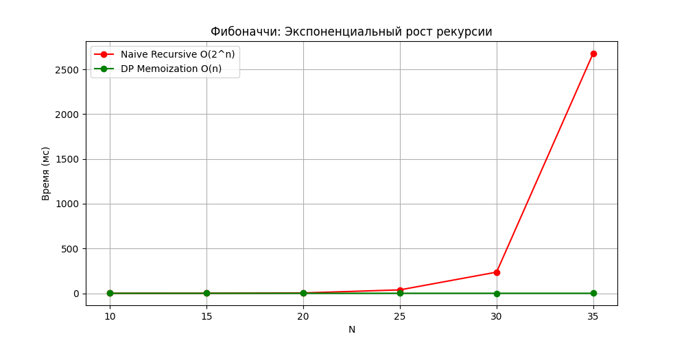
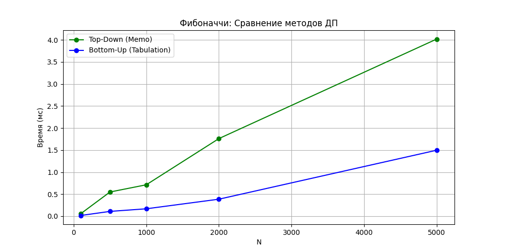

# Лабораторная работа №09
# Динамическое программирование

**Дата:** 2025-11-24
**Семестр:** 3 курс, 2 полугодие — 6 семестр
**Группа:** ПИЖ-б-о-23-1
**Дисциплина:** Анализ сложности алгоритмов
**Студент:** Пронченко Савелий Олегович

---

## Цель работы
Изучить метод динамического программирования (ДП).
- Реализовать два подхода: **Нисходящий** (Memoization) и **Восходящий** (Tabulation).
- Решить классические задачи оптимизации: Рюкзак 0-1, LCS, Левенштейн.
- Научиться восстанавливать решение (набор предметов, строку) по таблице ДП.
- Сравнить эффективность ДП с наивной рекурсией и жадными алгоритмами.

## Теоретическая часть

### Основные принципы ДП:
1. **Оптимальная подструктура:** Оптимальное решение задачи строится из оптимальных решений её подзадач.
2. **Перекрывающиеся подзадачи:** Одни и те же подзадачи решаются многократно (в отличие от "Разделяй и властвуй").

### Подходы:
- **Top-Down (Мемоизация):** Рекурсия с кэшированием результатов. Легче писать, но тратит память на стек.
- **Bottom-Up (Табуляция):** Заполнение таблицы от простых случаев к сложным. Экономит память на стеке, часто быстрее.

---

## Реализация и Сложность

### 1. Числа Фибоначчи
- **Наивная рекурсия:** `O(2^n)` — пересчитывает одни и те же ветви миллионы раз.
- **ДП (Memo/Tabulation):** `O(n)` — каждая подзадача решается 1 раз.

### 2. Рюкзак 0-1 (Knapsack)
- **Метод:** Таблица `dp[n+1][W+1]`.
- **Формула:** `dp[i][w] = max(dp[i-1][w], value + dp[i-1][w-weight])`.
- **Сложность:** `O(N * W)`, где W — вместимость. Это псевдо-полиномиальная сложность.

### 3. НОП (LCS)
- **Метод:** Таблица `dp[len1+1][len2+1]`.
- **Сложность:** `O(N * M)`.

### 4. Расстояние Левенштейна
- **Метод:** Таблица, операции вставки, удаления, замены.
- **Сложность:** `O(N * M)`.

---

## Результаты анализа

### 1. Фибоначчи: Рекурсия vs ДП
График показывает "взрывной" рост времени наивной рекурсии уже при N=30. Методы ДП (зеленая линия) остаются на уровне оси X.

### 2. Сравнение подходов ДП (Memo vs Tab)
На больших N (до 5000) табуляция работает немного быстрее мемоизации, так как отсутствуют накладные расходы на рекурсивные вызовы функций.

### 3. Рюкзак: ДП vs Жадный
Был проведен эксперимент для дискретного рюкзака (0-1).
- **Вход:** Вес 50. Предметы: (10кг, 60), (20кг, 100), (30кг, 120).
- **Жадный выбор:** Взял предметы 1 и 2. Итог: **160**.
- **ДП (Оптимальный):** Взял предметы 2 и 3. Итог: **220**.

**Вывод:** Динамическое программирование гарантирует нахождение глобального оптимума в задачах, где жадный подход дает сбой из-за нарушения принципа жадного выбора.

---

## Контрольные вопросы

### **1. Какие два основных свойства задачи указывают на применимость ДП?**
1. **Оптимальная подструктура:** Глобальное решение можно собрать из решений подзадач.
2. **Перекрывающиеся подзадачи:** Алгоритм многократно обращается к одним и тем же подзадачам (например, `fib(3)` вызывается много раз при расчете `fib(5)`).

### **2. В чем разница между Top-Down и Bottom-Up?**
- **Top-Down (сверху вниз):** Идем от главной задачи к базовым случаям рекурсивно. Сохраняем ответы в словарь. Вычисляем только то, что нужно.
- **Bottom-Up (снизу вверх):** Заполняем таблицу от базовых случаев (0, 1) до целевого N итеративно. Вычисляем все подзадачи подряд.

### **3. Как строится таблица для задачи о рюкзаке 0-1?**
Таблица размером `(Количество предметов + 1) x (Вместимость + 1)`.
Ячейка `dp[i][w]` хранит максимальную стоимость, которую можно получить, используя только первые `i` предметов и имея вместимость `w`.

### **4. Как восстановить решение (какие предметы взяли) по таблице ДП?**
Начинаем с правого нижнего угла `dp[n][W]`. Идем вверх к началу:
- Если `dp[i][w] == dp[i-1][w]`, значит, предмет `i` **не брали** (значение пришло сверху). Переходим к `dp[i-1][w]`.
- Если значения отличаются, значит, предмет `i` **взяли**. Добавляем его в ответ и переходим к состоянию `dp[i-1][w - вес_предмета]`.